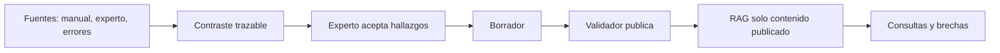

# Arquitectura MVP

## Implementado

- Roles, cargos, unidades y flujo borrador → validación → publicación.
- RAG filtrado por cargo y por estado publicado.
- Chat web, voz del navegador, QR y confirmación local de lectura.
- Vertical slice de contraste con fuentes, cuatro tipos de divergencia, evidencia y borrador derivado.
- Datos demo determinísticos, reset protegido, CI y chequeo de demo.

## Prototipo / demostración

- El contraste guardado es sintético; sirve para explicar la trazabilidad del flujo.
- Anthropic se usa solo al reintentar un contraste y falla de forma explícita, sin guardar resultados parciales.
- Las métricas del dashboard son datos demostrativos, no mediciones de impacto.

## Fuera de alcance actual

- Multiempresa, WhatsApp, facturación, SSO, seis fuentes completas, integraciones POS/WMS/RR.HH.
- Progreso persistente en servidor, historial completo/atómico de versiones y métricas causales de impacto.

El siguiente hito es un piloto con material real aprobado, aislamiento por organización y evaluación de impacto antes de hacer afirmaciones comerciales cuantitativas.
